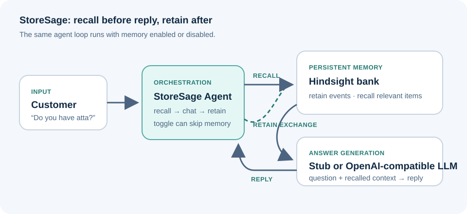

# I Gave a Shopkeeper’s Agent a Memory with Hindsight

A customer asks, “Do you have atta?” A conventional chatbot can check a catalog. A useful shopkeeper’s assistant should also remember that Lakshmi buys a five-kilogram bag every month, prefers home delivery, and asked about a mixer grinder that was out of stock. The hard part is not generating another fluent answer. It is carrying the right context into the next conversation without making Lakshmi repeat herself.

That is the problem I built StoreSage to explore: a WhatsApp-style assistant for small retailers where memory changes the answer, and where the memory operations are visible in the code.

## The application is a loop, not a larger prompt

StoreSage has a Gradio chat interface, an agent that coordinates each turn, a language-model adapter, and a memory layer backed by [Hindsight](https://github.com/vectorize-io/hindsight). The interface can run the agent with memory enabled or disabled and shows the memories returned for a turn. That switch gives us a controlled comparison: same question, same agent logic, different access to stored history.



The memory boundary is kept in `src/memory.py`. The rest of the application talks to `MemoryBank`; that class chooses the Hindsight connection and exposes `remember`, `recall`, and `reflect`. StoreSage’s ordinary chat path uses the first two. Keeping that boundary small matters: the agent can coordinate a conversation without depending on Hindsight client response shapes or connection details.

Here is the core turn in `src/agent.py`:

```python
def respond(self, user_text: str, speaker: str = "customer") -> TurnResult:
    memories = self.memory.recall(user_text) if self.memory_enabled else []
    reply = self.llm.chat(self.system_prompt, memories, user_text)
    if self.memory_enabled:
        self.memory.remember(f"{speaker}: {user_text}")
        self.memory.remember(f"assistant: {reply}")
    return TurnResult(
        reply=reply, memories_used=memories, memory_enabled=self.memory_enabled
    )
```

There are three steps: recall context, generate a reply with that context, and retain the new exchange for a later turn. The memory-off path skips recall and retention. It gives us a useful baseline and keeps the comparison focused on whether the agent has access to stored history.

## What Hindsight contributes

An agent needs more than a transcript if it is going to answer a short question using history expressed in different words. StoreSage sends conversational events to Hindsight and asks it to recall relevant items for the customer’s current message. The model receives those recalled items as context; StoreSage also returns them in `TurnResult`, so the interface can show what informed the answer.

The adapter makes the write operation explicit:

```python
def remember(self, content: str) -> None:
    self._client.retain(bank_id=self.bank_id, content=content)
```

And recall remains a narrow operation with a bounded result list:

```python
def recall(self, query: str, top_k: int = 5) -> list[str]:
    if not self.enabled:
        return []
    results = self._client.recall(bank_id=self.bank_id, query=query)
    return [self._text(r) for r in self._as_list(results)[:top_k]]
```

Hindsight results pass through `_as_list` and `_text`, which normalize common list, dictionary, and object responses into strings. The agent therefore works with a stable `list[str]` contract instead of carrying client-specific response structures into the prompt or interface.

That separation is useful for two reasons. First, the application can pass ordinary strings to its language-model adapter instead of coupling the prompt to a particular memory SDK’s result objects. Second, the interface can display the same list the agent received. Memory is inspectable behavior in the product, not a hidden claim that the model somehow “learned.”

The integration supports Hindsight’s embedded mode, which starts a local service, and a server mode configured with a URL. The application assigns a bank identifier to its memory operations so events can be grouped under a chosen context. The [Hindsight documentation](https://hindsight.vectorize.io/) describes the broader system; StoreSage uses the retain and recall path directly in its chat loop. The larger case for [agent memory](https://vectorize.io/what-is-agent-memory) is straightforward: model weights provide general knowledge, while memory provides relevant context accumulated from interactions.

## A concrete before-and-after

Consider Lakshmi, who buys a five-kilogram bag of whole-wheat atta each month and prefers delivery to Kukatpally. She also asked for a mixer grinder while it was unavailable. Later, the shopkeeper records that the grinder is back in stock. As those conversations and shop updates arrive, StoreSage retains them in its configured Hindsight bank.

Now Lakshmi sends a short message: “Hi, do you have atta?”

**Memory off:** the `StubLLM` has no customer history. Its response says it has no past context and needs more detail before giving a specific recommendation. The `memories_used` list is empty.

**Memory on:** the agent first queries the configured bank. When Hindsight returns relevant history, the stub includes those items in its response and suggests following Lakshmi’s usual pattern. With a configured OpenAI-compatible endpoint, the `OpenAILLM` adapter instead adds recalled items to the system message before sending the question to the model.

The interaction is deliberately ordinary. There is no elaborate chain of tools to hide behind. A short question becomes useful because the system retrieves context that is absent from the message itself. The memory panel makes that causal link observable: you can inspect the returned items alongside the answer rather than guessing which detail influenced it.

The model adapter is also a deliberate seam. With no API key, `get_llm()` selects `StubLLM`, making the memory path available without requiring a model account. When a key is configured, the same agent loop can use an OpenAI-compatible service. This keeps the memory experiment independent of the choice of answer-generation provider.

## What I learned from keeping the boundary small

**Memory needs an owner.** The bank identifier is passed into `Agent` and then into `MemoryBank`; recall and retention both use that identifier. That makes the storage context explicit in the code instead of hiding it inside a prompt.

**Recall should be inspectable.** Returning `memories_used` with each turn lets the UI show what the system retrieved. When an answer is wrong, an engineer can ask whether retrieval missed the fact, surfaced irrelevant context, or the language model used it badly. That is a more useful debugging starting point than treating the response as one opaque operation.

**Separate memory from the model.** `MemoryBank` handles storage and retrieval; the LLM adapter is responsible for the reply. This makes it possible to change one side without rewriting the agent’s turn structure. It also makes the memory-off path a clean comparison rather than a second application.

## One honest limitation

The current interface runs against one configured bank, and the agent retains both the customer’s message and the assistant’s full reply. That means different customers’ events can share a memory scope, and generated text can return later as context even when it was incomplete or stale. Before storing live customer conversations, I would route each interaction to an identity-scoped bank and add provenance and correction rules that distinguish a customer-confirmed preference from an assistant-generated suggestion.

## The useful question is what the agent remembers

StoreSage began with a simple observation: repeat customers should not have to introduce themselves every time they message a shop. Hindsight gives the application a concrete retain-and-recall interface for carrying that context between turns, while the agent loop stays small enough to inspect.

That changes the engineering question from “Can the model answer this?” to “What context did it retrieve, why was that context stored, and should it still be available?” Those are more specific questions, and they lead to better debugging conversations than another prompt tweak.

The code is in the [StoreSage project repository](https://github.com/mekalaabhilash9894/hindsight). To explore the memory layer itself, start with the [Hindsight GitHub repository](https://github.com/vectorize-io/hindsight), the [Hindsight documentation](https://hindsight.vectorize.io/), and Vectorize’s overview of [agent memory](https://vectorize.io/what-is-agent-memory).
